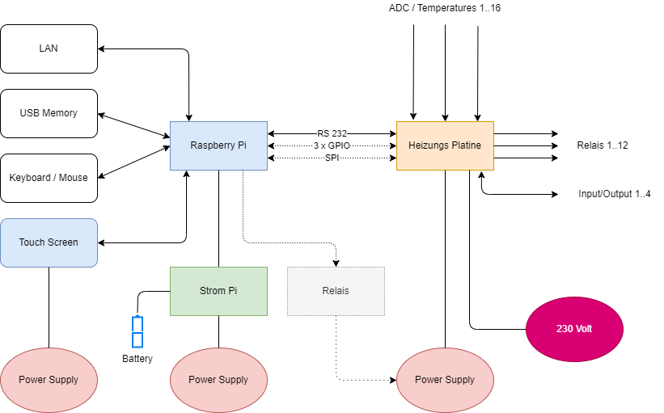
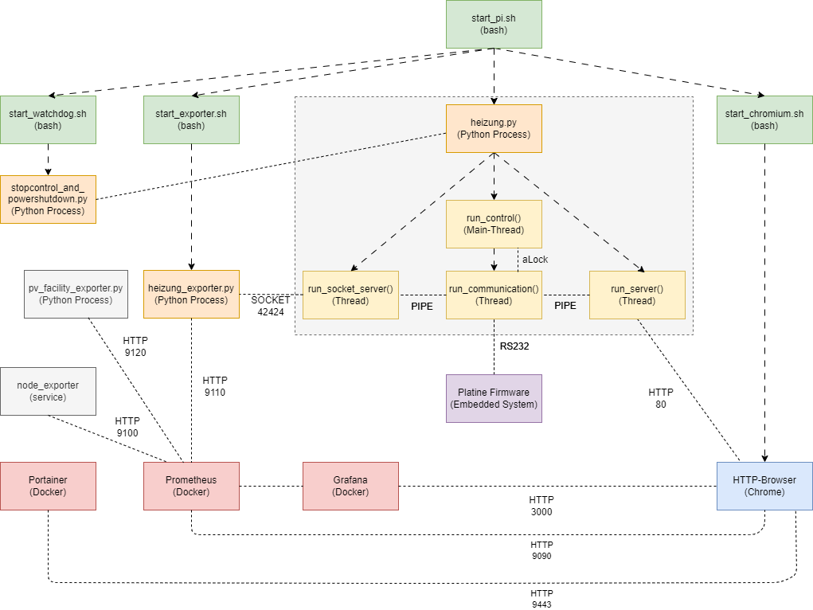
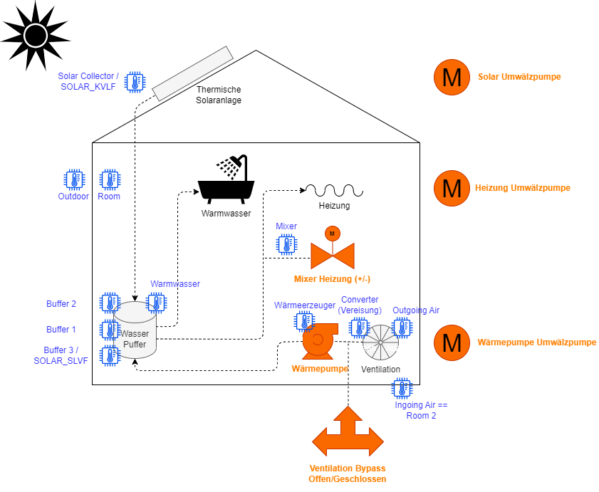

# Heizungsregelung

Das Heizungsreglung Projekt enthält die Dokumentation der Hardware (Platine und Computer-Boards) und der Software (Firmware und Regelungs-Programm)
um die Technik für ein Passivhaus zu betreiben.

In diesem [Dokument](0_Einleitung.md) gibt es eine [Einleitungen](0_Einleitung.md) zur Bedienung der Heizungsregelung.

## Übersicht Gesamtsytem Heizungsregelung

Blockdiagramm des [Hardware Systems](bilder):



Siehe auch [Übersichtsfoto vom gesamten System](bilder/README.md) 

***

## Übersicht Heizungs Platine

Blockdiagramm der [Heizungs Platine](bilder):


Schematische Ansicht der Heizungs Platine:


Foto: 


***

## Übersicht Software Komponenten

Blockdiagramm des [Software Systems](bilder):



***

## Übersicht Pasiv-Haus

Blockdiagramm des [Passiv Haus](bilder):



***

## Beschreibung der Funktionalität

Folgende Komponenten werden via Relais angesteuert:
---------------------------------------------------

Siehe auch [Quellcode für Regelung](heizung.py)

 Relais Nr  | Funktion                      | Bemerkung | LED
 -----------|-------------------------------|-----------|---------
  1         | Solar-Kreislauf-Umwälzpumpe   |           | D700
  2         | Heizungs-Umwälzpumpe          |           | D701
  3         | Wärmepumpe                    | siehe auch Relais #6           | D702
  4, 5      | Lüftungsanlage Bypass Ventil  | seit 8.9.2019: #5 ist Bypass Kanal Close (Braun), #4 ist Bypass Kanal Open (Blau) ==> ACHTUNG: immer wechselseitig schalten!! Ähnlich wie Mixer (D704 ist immer an, wenn Bypass geschlossen!) | D703, D704 
  6         | Zirkulationspumpe für Wärmepumpe | muss laufen wenn Wärmepumpe läuft! (seit August 2013) | D705
  7, 8      | Heizungs-Kreislauf-Mixer | 2-fach: Plus und Minus Richtung | D706, D707


Folgende Temperatur Sensoren gibt es:
-------------------------------------

 ADC-Nr |Arduino Pin | Funktion           | Nr im Plot | Bezeichnung im Programm | Sensor im Testbetrieb
 -------|------------|--------------------|------------|-------------------------|---------------------------------
   0    |         1  | SolarCollector     |    2       | SOLAR_KVLF              | PT1000 (Conrad, klein)
   1    |         2  | Buffer 3           |    3       | SOLAR_SLVF              | NTC20 (Haus-Sensor)
   2    |         3  | Outdoor            |    7       | OUTDOOR                 | NTC20 (Conrad, klein)
   3    |         4  | Mixer              |   10       | MIXER_HEATING           | NTC20 (Conrad, klein)
   4    |         5  | Buffer 1           |    5       | BUFFER1                 | NTC20 (Conrad, klein)
   5    |         6  | Buffer 2           |    6       | BUFFER2                 | NTC20 (Conrad, klein)
   6    |         7  | Outgoing Air       |    8       | HEATPUMP_OUTGOING_AIR   | NTC20 (Conrad, klein) (in der Abluft von Lueftungsanlage zur Waermepumpe)
   7    |         8  | Warmwasser         |    4       | WARM_WATER              | NTC20 (Conrad, klein)    
   8    |         9  | Waermeerzeuger     |    1       | HEAT_CREATOR            | NTC20 (Conrad, klein) (im Zulauf von Waermepumpe zu Buffer)
   9    |         10 | Ingoing Air == Room (builtin) | | INGOING_AIR == ROOM2    | NTC20 (in Klemme eingebaut) ==> PT1000 bei ArduinoMega Board 
  10    |         11 | Converter          |    9       | CONVERTER and LIGHT1    | NTC20 (Conrad, klein) org: <not used>   LIGHT1
  11    |         12 | Room (movable)     |            | ROOM and LIGHT2         | NTC20 (externer, orginaler, freihängender Sensor) LIGHT2  ==> Special Handling bei ArduinoMega Board (kann nicht für NTC20 genutzt werden)
  12    |         13 | Room (builtin)     |            | ARDUINO_COUNT           | NTC20 (in Klemme eingebaut) ==> ROOM since 25.11.2018
  ...   |            |                    |            |                         | 
  15    |         16 | PT1000 Test Sensor |   11       | TESTSENSOR_PT1000       | PT1000 (Haus-Sensor)

Pinbelegung für ADC Eingänge:
-----------------------------

Siehe auch [Quellcode für Heizungsplatine Firmware](heatcontrol_firmware/heatcontrol_firmware.ino):

Logische Klemme/Arduiono Pin (Output-Kanal via RS232) |   Board Klemme  |  IC4  (MCP3008)  |  IC5 (MCP3008)  |   IC2 (ATMEL) 
-----------|-----------------|--------|--------|---------
1 (PT1000) |       KL8       |  ADC7  |        |  ADC0
2          |       KL7       |  ADC6  |        |  ADC1
3          |       KL6       |  ADC5  |        |  ADC2
4          |       KL5       |  ADC4  |        |  ADC3
5          |       KL4       |  ADC3  |        |  ADC4
6          |       KL3       |  ADC2  |        |  ADC5
7          |       KL2       |  ADC1  |        |  ADC6
8          |       KL1       |  ADC0  |        |  ADC7
9          |       KL16      |        |  ADC7  |
10         |       KL15      |        |  ADC6  |
11         |       KL14      |        |  ADC5  |
12         |       KL13      |        |  ADC4  |
13         |       KL12      |        |  ADC3  |
14         |       KL11      |        |  ADC2  |
15         |       KL10      |        |  ADC1  |
16 (PT1000)|       KL9       |        |  ADC0  |

Pins vom Raspberry Pi GPIO-Stecker auf der Platine:
---------------------------------------------------

 Pin auf Platine | Pin Nummer auf GPIO-Stecker | Raspberry Pi Pin Nummer
 ----------------|-----------------------------|--------------------------
  IO1            | GPIO 4                      |  7
  IO2            | GPIO 27                     | 13
  IO3            | GPIO 17                     | 11
  K1101          | GPIO 14 (TXD für RS232)     | 8
  K1102          | GPIO 15 (RXD für RS232)     | 10
  MOSI           | GPIO 10 (MOSI für SPI Bus)  | 19
  MISO           | GPIO 9 (MOSI für SPI Bus)   | 21
  SCLK           | GPIO 11 (SCLK für SPI Bus)  | 23
  +3.3V          |                             |  1
  +5V            |                             |  2, 4
  GND            |                             |  6, 14, 20

***

Hardware
--------

Das [gesamte System (Version 2)](bilder/20210605_120752_HDR.jpg) besteht aus den folgenden Hardware Komponenten:

* Heizungs Regelungs Platine
* [Raspberry PI 3 Model B Rev 1.2](https://www.raspberrypi.com/products/raspberry-pi-3-model-b/) mit 1 GByte RAM 1.2 GHz ARM CPU mit 4 Kernen -> [Pinbelegung](https://www.elektronik-kompendium.de/sites/raspberry-pi/1907101.htm)
* [Strompi2](https://joy-it.net/de/products/rb-StromPi2)
* [10'' Touchscreen](https://joy-it.net/de/products/RB-LCD-10B)
* 3x Netzgerät
* optional: Tastatur

Das [alte System (Version 1)](bilder/20190504_145148.jpg) bestand aus den folgenden Hardware Kompomenten:

* [Arduino Mega](https://store.arduino.cc/products/arduino-mega-2560-rev3)
* Manuell verdrahtete Europlatinen für Arduino und Temperatur Messung
* Manuell verdrahtete Europlatine für RS232 Adapter
* [Conrad Relais Karte](https://www.conrad.de/de/p/conrad-components-197730-relaiskarte-baustein-12-v-dc-197730.html)
* [Friendly Arm](https://www.friendlyelec.com/index.php?route=product/product&path=59&product_id=54)


Software
--------

Es gibt zwei Software Komponenten, die für den Betrieb des Systems notwendig sind:

* [Firmware für die Heizungsplatine](heatcontrol_firmware), erstellt mit der [Arduino IDE](https://www.arduino.cc/en/software)
* [Regelungs Programm](heizung.py) für den Raspberry Pi, erstellt in Python

Zusätzlich gib es noch einige Tools und Skripte um das System zu atomatisieren und analysieren:

* [Auswerteprogramm view_temp.py](view_temp.py) der Temperatur Sensor Daten
* [Auto Start Skript](start_pi.sh) für den Rasperry Pi
* [Desktop Icon](start_heizung.destop) für Rasperry Pi
* Backup Skript um die Temperatur Sensor Daten auf einem NAS zu sichern
* [Prometheus Exporter für Heizungsregelung](heizung_exporter.py)

Obsolete Software:

* [Firmware für die Arduino Mega Platine](arduino_firmware), erstellt mit der Arduino IDE
* Auto Start Skripte für den Friendly Arm: start_loop_control.sh

Bedienung
---------

Gesteuert wird die Heizungsregelung über eine [Web-Oberfläche -> http://heizungsregelung](http://heizungsregelung) die auf dem Raspberry Pi läuft.

<p float="left">
  
  
</p>

Die Daten der Heizungsregelung können auch über das [Grafana Tool](http://heizungsregelung:3000/d/aPa8n1Y4kY/4prod-heinzungsregelung?orgId=1) angezeigt werden.


Verfügbare Kommandos für die Web-Oberfläche sind:
* PLOT
* EXCEPTION
* EXTENDED
* HELP
* CTRL_VERSION
* READ
* VIEW
* STOP
* WRITE
* SIMPLE
* HTML
* RESTART
* READ_PLOT
* SRV_VERSION
* QUERY_PLOT_DATA
* HISTORY

Auf den Raspberry Pi kann man sich via `VNC` oder `ssh` einloggen.

    >ssh pi@heizungsregelung

    >vnc heizungsregelung:5900
	
Parameter für heizung.py:

    > python heizungsregelung.py -h
    >
    > heating control programm, available options:
    > -s : silent modus, no debugging output
    > -i : use simulation port 8008 for http
    > -p : use default port 80 for http
    > -t : test without hardware (simulate hardware)
    > -e : use exclusive access modus for RS232 interface
    > -c : run with history cache
    > -d : run without history cache
    > -w : disable watchdog in python program
    > -h : show this help

Firmware
--------

Folgende Kommandos in der Firmware der Heizungsplatine bekannt und können via RS232 (19200 Baud, 8 Bit, keine Parität) genutzt werden. Die Kommandos müssen mit `;` abgeschlossen werden.

Kommandos    | Beschreibung  | Verwendet
-------------|---------------|-----------
READ_DATA    | Liefert alle aktuellen Daten.                                                     |
READ_TEMP    | Liefert die aktuellen Werte aller Temperatur Sensor Eingänge.                     | Ja
READ_IO      | Liefert die aktuellen Werte der IOs.                                              |
READ_RELAIS  | Liefert die aktuellen Werte der Relais.                                           |
SET_RELAIS   | Setzt ein oder mehrere Werte für Relais.                                          | Ja
READ_TIME    | Liefert den aktuellen Wert der Echtzeituhr.                                       |
SET_TIME     | Setzt die Echtzeituhr.                                                            |
DUMP_TEMP    | Schaltet den Temperatur-Dump Modus ein und liefert ständig Temeraturwerte zurück. |
DUMP_STOP    | Schaltet den Temperatur-Dump Modus aus.                                           |
DEBUG        | Schaltet den Debug-Modus ein.                                                     |
PING         | Testet die Kommunikation, liefert PONG                                            | Ja
VERSION      | Lifert die Version und das Datum der Firmware der Platine.                        | Ja
HELP         | Liefert alle verfügbaren Kommandos an.                                            |
RESTARTS     | Liefert die Anzahl der Neustarts der Platine.                                     | Ja

Beispiele:

- `VERSION;` -> `VERSION=2.0 from 29.1.2018;`
- `READ_IO;` -> `io1=0;io2=0;io3=0;io4=1`
- `READ_RELAIS;` -> `Rel1=0;Rel2=0;Rel3=0;Rel4=0;Rel5=0;Rel6=0;Rel7=0;Rel8=0;Rel9=0;Rel10=0;Rel11=0;Rel12=0`
- `SET_RELAIS:Rel1=1;` -> `OK:Rel1=1`

Historie
--------

Datum        | Aktion
-------------|----------------
18.4.2010    | Beginn der Tests für Version 1 mit Arduino Mega, Conrad Relais Karte und handgelötete Euro-Platinen
7.11.2010    | Inbetriebnahme Hardware Version 1
10.2013      | HTML Seite zur Steuerung realisiert
10.1.2017    | HeatingBoard Platine V1.0 bestellt
27.9.2017    | HeatingBoard Platine V1.2 bestellt
4.5.2019     | Inbetriebnahme Hardware Version 2, mit HeatingBoard Platine V1.2 und Raspberry Pi 3 Model B Rev 1.2 mit Raspbian OS based on Debian 9 (Stretch)
 11.2019     | Privates GitHub Projekt heizungsregelung angelegt
5.6.2021     | Erweiterung der Dokumentation auf der Github Projekt Seite
29.1.2022    | Vorbereitung der Migration auf Python 3
26.3.2023    | Begonnen mit Docker Installation, dazu Aktualisierung auf Debian 11 (Bullseye) und Umstellung auf Python 3.9.2
 3.4.2023    | Begonnen mit der Unterstützung der Socket Kommunikation (für Dockerisierung)
 5.4.2023    | Begonnen mit der Unterstützung des prometheus_exporter.py
22.4.2023    | Erweiterung der Dokumentation für die Platine und für das Passiv Haus
 7.5.2023    | Öffentliches GitHub Projekt heizungsregelung-public angelegt
 5.2023      | Verbesserung der Robustheit und Wiederverbindungsmöglichkeit der RS232 Kommunikation
23.5.2023    | Verwende stabilere PL011 anstatt miniuart für RS232 Kommunikation

Funktionen der Heizungsregelung
-------------------------------

* Temperatur-Schwellwert gesteuertes ein- und ausschalten der Solar-Kreisluaf-Umwälzpumpe um den Wasserpuffer zu heizen
* Temperatur-Schwellwert gesteuertes ein- und ausschalten der Wärmepumpe um den Wasserpuffer zu heizen
* Zeitbereich gesteuertes ein- und ausschalten der Heizungs-Umwälzpumpe
* Temperatur gesteuertes ausschalten der Heizungs-Umwälzpumpe: falls die Außentemperatur größer 10°C ist, bleibt die Umwälzpumpe ausgeschaltet
* Temperatur Regelung der Temperatur des Heizungs-Kreislaufes via Mixer
* Anti-Festlauf Steuerung für Heizungs-Umwälzpumpe: die Umwälzpumpe wird einmal am Tag um 22:30 Uhr für 5 Minuten eingeschaltet
* Ansteuerung des Lüftungs Bypass Ventils (auf/zu)
* Ansteuerung der Zirkulationspumpe der Wärmepumpe (wegen Reparatur der Wärmepumpe im August 2013): Zirkulationspumpe läuft, wenn Wärmepumpe läuft

Einstellungen der Zeitbereiche
------------------------------

Strom für Wärmepumpe | Zeitbereich | Tag
------------- | -------------- | --------
ausgeschaltet | 11:30 -> 13:00 | Mo - Fr
ausgeschaltet | 17:30 -> 19:00 | Mo - Fr

Heizung Umwälzpumpe | Zeitbereich | Tag  | Bemerkung
------------- | -------------- | ------- | ------
eingeschaltet | 8:00 -> 14:00  | Mo - Fr | 1. November - 1. März
eingeschaltet | 9:00 -> 17:00  | Sa, So  | 1. November - 1. März
eingeschaltet | 21:00 -> 3:00  | Mo - So | 1. November - 1. März
eingeschaltet | 22:30 -> 22:35 | Mo - So | jeden Tag wegen Anti-Festlauf

Mixer schließen | Zeit | Tag
--------------- | ---- | -----
schließen | 14:00 | Mo - So
schließen | 17:00 | Mo - So
schließen | 13:00 | Mo - So

Installation (Software)
-----------------------

Schritte zur Installation und Einrichtung des Heizungregelungs Software Systems:

- Raspberry Pi Einrichtung
    - Raspberry OS Linux Betriebssystem auf SD Karte einrichten
    - Verwende UART für RS232 auf Raspberry Pi 3 (default: Bluetooth uses UART and RS232 uses MINI-UART which is not so stable), see: [RS232 on Raspberry Pi 3](https://pi-buch.info/die-serielle-schnittstelle-auf-dem-raspberry-pi-3/)
        - siehe umfrangreiche Dokumentation für [UART Kommunikation auf Raspberry Pi](https://www.electronicwings.com/raspberry-pi/raspberry-pi-uart-communication-using-python-and-c)
        - Verwende `PL011` für UART Kommunikation und `miniuart` für die Bluetooth Kommunikation (miniuart ändert Baudrate mit CPU/GPU Frequenz und ist daher nicht so stabil wie PL011!) und ggf. `WLAN` ausschalten: --> edit `/boot/config.txt`
            - `dtoverlay=pi3-miniuart-bt` oder neu: `dtoverlay=miniuart-bt`
            - `dtoverlay=pi3-disable-wifi`
    - Benenne den USB-Memory-Stick in `USB_DATA` -> es sollte folgender Pfad verfügbar sein `/media/pi/USB_DATA/heating_control`
	- Docker installieren -> [Wie man Docker auf dem Raspberry Pi in 15 Minuten einrichtet | heise online](https://www.heise.de/news/Wie-man-Docker-auf-dem-Raspberry-Pi-in-15-Minuten-einrichtet-7524692.html)
	    - `> curl -fsSL https://get.Docker.com -o get-Docker.sh`
	    - `> sudo sh get-Docker.s`
	    - `> sudo usermod -aG docker $USER`
	    - `> newgrp docker`
	    - `> docker run hello-world`
	    - `> docker volume create portainer_data`
	    - `> docker run -d -p 8000:8000 -p 9443:9443 --name portainer --restart=always -v /var/run/docker.sock:/var/run/docker.sock -v portainer_data:/data portainer/portainer-ce:latest`
		- Prometheus Node Exporter einrichten (aus Raspbian Repository): `sudo apt-get install prometheus-node-exporter`		
		- Prometheus Docker Container starten: `docker run -d -p 9090:9090 --restart=always --name prom -v /home/pi/Dokumente/projects/heizungsregelung/prometheus.yml:/etc/prometheus/prometheus.yml prom/prometheus`
		- Grafana Docker Container starten:`docker run -d --restart=always --name=grafana -p 3000:3000 grafana/grafana`
		    - [Grafana Dashboard für Pi und Docker Monitoring](https://grafana.com/grafana/dashboards/15120-raspberry-pi-docker-monitoring/)
			- [Grafana Dashboard für Prometheus Node Exporter Monitoring](https://grafana.com/grafana/dashboards/9894-node-exporter-0-16-for-prometheus-monitoring-display-board/)
        - [Portainer für heizungsregelung](https://heizungsregelung:9443/#!/init/admin) -> user: admin / ??? (Portainer-Admin-Password)
		- [Grafana für heizungsregelung](http://heizungsregelung:3000/) -> user: admin / ??? (Raspberry Pi Default User Password)
		- [Prometheus für heizungsregelung](http://heizungsregelung:9090/)
		- [Prometheus Linux Node Exporter](http://heizungsregelung:9100/)
		- [Prometheus Heizungsregelung Node Exporter](http://heizungsregelung:9110/)
	- Konfiguration des Raspberry Pi anpassen
	   - Name: `heizungsregelung` -> Zugriff über http://heizungsregelung möglich
	   - Schnittstellen aktivieren (Raspberry Pi Konfigurations-Menu):
		   - ssh
		   - VNC
		   - Serial Port
	   - Schnittstellen deaktivieren:
		   - SPI
		   - I2C
		   - Serial Console
		   - ...		   
	- `> cd /home/<user_name>/Dokumente/projects`
	- `> git clone https://github.com/mneuroth/heizungsregelung-public.git`
	- Testen des Heizungsreglungs Programms: 
        - `> python heizung.py -t -i`
        - Verwende Browser mit [dieser URL](localhost:8008) um Web-Oberfläche anzuzeigen: 
           - __ACHTUNG:__ Port 8000 ist durch Docker/Portainer belegt !
	- Shell Skript `start_pi.sh` als Skrip im Autostart einrichten, siehe `start_heizung.desktop`. Siehe auch [Dokumentation](https://learn.sparkfun.com/tutorials/how-to-run-a-raspberry-pi-program-on-startup/method-2-autostart).
	    - Erzeuge folgende Datei `/home/<user_name>/.config/autostart/heizung.destop` mit folgendem Inhalt:
		    - ```
			  [Desktop Entry]
              Type=Application
              Name=Heizung
              Terminal=true
              Exec=lxterminal -t "Heizungsregelung" --working-directory=/home/<user_name>/Dokumente/projects/heizungsregelung/ -e ./start_pi.sh
              StartupNotify=false
              ```
	    - In diesem Autostart Skript werden folgende Prozesse gestartet:
	        - Chrome-Browser (via `start_chromium.sh`)
		    - Watchdog Prozess zum definierten Herunterfahren des Raspberry Pi im Falle eines Stromausfalls (`start_watchdog.sh` im `strompi2` Verzeichnis)
		    - Heizungsregelungs Prozess (`sudo python heizung.py -s -w -p`)
- Heizungregelungs-Platinen Einrichtung
    - [Arduino IDE](https://www.arduino.cc/en/software) herunterladen und installieren
	- Verwendeter Microcontroller: [ATMEGA1284P ](https://www.reichelt.de/8-bit-atmega-avr-mikrocontroller-128-kb-20-mhz-dip-40-atmega-1284p-pu-p112738.html?CCOUNTRY=445&LANGUAGE=de&trstct=pos_0&nbc=1&&r=1) mit 20 MHz, 128kByte Flash, 16kByte RAM, 4kByte EEPROM (optional auch `ATMEGA32-16` mit mit 32kByte Flash, 2kByte RAM, 1kByte EEPROM)
	- ISP Programmer STK500 kompatibel (z. B. [Diamex USB-ISP-Stick AVR-Programmieradapter](https://www.diamex.de/dxshop/DIAMEX-USB-ISP-Programmer-Stick-fuer-AVR))
	- ISP Programmer an K200 Stecker (ISP) anschließen
	- Firmware Projektdatei [heatcontrol_firmware.ino](heatcontrol_firmware/heatcontrol_firmware.ino) in der Arduino IDE öffnen
	- Board: `ATmega1284p-16MHz` auswählen (Einstellungen aus http://openhardware.ro/boards übernommen, siehe [Archiv](heatcontrol_firmware/avr-openhardware.ro-1.0.0.zip))
	- Programmer: `Atmel STK500 development board` auswählen
	- Projekt compilieren
	- Microcontroller via ISP Programmer flashen
	- Taktfrequenz für Atmel Microcontroller korrekt einstellen (Fuse Bits, siehe: http://www.engbedded.com/fusecalc/)	
	- Auslesen der Fuse Bits: `C:\Users\micha\AppData\Local\Arduino15\packages\arduino\tools\avrdude\6.3.0-arduino17\bin\avrdude -v -patmega1284p -PCOM6 -cstk500 -CC:\Users\micha\AppData\Local\Arduino15\packages\arduino\tools\avrdude\6.3.0-arduino17/etc/avrdude.conf -U hfuse:r:-:h -U lfuse:r:-:h -U efuse:r:-:h`
	    - liefert: `lfuse=0xff  hfuse=0x99  efuse=0xFF` -> Ext. Crystal Osc.
	- Setzen der Fuse Bits: `C:\Users\micha\AppData\Local\Arduino15\packages\arduino\tools\avrdude\6.3.0-arduino17\bin\avrdude -v -patmega1284p -PCOM6 -cstk500 -CC:\Users\micha\AppData\Local\Arduino15\packages\arduino\tools\avrdude\6.3.0-arduino17/etc/avrdude.conf -U lfuse:w:0xff:m -U hfuse:w:0x99:m -U efuse:w:0xff:m`
	- __ACHTUNG:__ Falls die Fuse Bits nicht korrekt sind, kann die Kommunikation via RS232 nicht korrekt funktionieren, bzw. falsche Baud-Raten gesetzt werden
- Raspberry Pi mit Strompi2 verbinden (montieren), siehe auch original Dokumentation [strompi2 Verzeichnis](strompi/README.md)
- Raspberry Pi und Heizungregelungs-Platine anschließen  
    - beide Platinen mit Flachband-Kabel miteinander verbinden
	- beide Platinen mit passenden Netzgeräten verbinden
- Raspberry Pi mit Touchscreen ([Joy-IT 10" IPS Display für Raspberry PI](https://www.conrad.de/de/p/joy-it-lcd10-v2-touchscreen-modul-25-7-cm-10-1-zoll-1280-x-800-pixel-passend-fuer-entwicklungskits-raspberry-pi-2201488.html?hk=SEM&gclid=Cj0KCQjw2v-gBhC1ARIsAOQdKY3i4aAIEsFwhB-fSOBDPflrY2LB_CBwbvFHVcpCkjgC3BXBQuXUxIcaAhjPEALw_wcB)) verbinden (HDMI und USB)

Installation (Hardware)
-----------------------

Schritte zur Installation und Einrichtung der Heizungsplatine:

- Jumper zur Einstellung der RS232 Kommunikation zwischen Microcontroller auf der Heizungsplatine und dem Raspberry Pi
    - verbinde Microcontroller mit RS232 Level Wandler MAX3232CPE via Jumper auf `K605` und `K606`
    - wähle Verbindung zwischen Microcontroller und Rasperry Pi (jeweils über Level Wandler):
        - Option 1: Verbindung direkt auf der Platine
        - Option 2: Verbindung über Stecker `COM_ATMEL` und `COM_PI`
    - Option 1:
        - Verbinde Ausgang Level Wandler mit Leitung auf Platine über `K603` und `K604` durch Jumper zwischen `Pin 1` und `Pin 2`
        - Verbinde Ausgang Level Wandler mit Leitung auf Platine über `K601` und `K602` durch Jumper zwischen `Pin 1` und `Pin 2`
    - Option 2:
        - Verbinde Ausgang Level Wandler mit Steckverbindung COM_ATMEL an `K603` und `K604` durch Jumper zwischen `Pin 2` und `Pin 3`
        - Verbinde Ausgang Level Wandler mit Steckverbindung COM_PI an `K601` und `K602` durch Jumper zwischen `Pin 2` und `Pin 3`
- Jumper zur Einstellung der vier IO Kanäle:
    - Option 1: Verwende IO als Ausgang oder Eingang über IO Driver 74HC244
        - Setze Jumper auf `K300/1/2/3` zwischen `Pin 2` und `Pin 3`
        - Konfiguriere IO Driver 74HC244:
          Jumper | Zustand | Zustand
          -------|---------|---------
          `K1004/6/7/8` | Offen | Geschlossen
          `K1000/1/2/3` | Geschlossen | Offen
          Signal Richtung | Output | Input
    - Option 2: Verwende IO als Ausgang über Output Driver ULN2803 und über IO Driver 74HC244
        - Setze Jumper auf `K300/1/2/3` zwischen `Pin 1` und `Pin 2`
        - Setze Jumper auf `K800/1/2/3`
        - Siehe Konfiguration für 74HC244 in Option 1
- Jumper zur Weiterleitung der 8 analogen Signale von ADC MCP3008 (IC4) für Arduino Pins 1..8
    - Jumper geschlossen `K400/1/2/3/4/5/6/7` -> analog Signal wird auf ADC Eingänger des Microcontrollers geleitet
